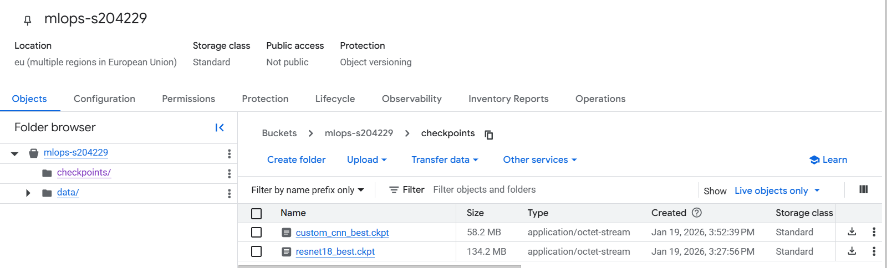
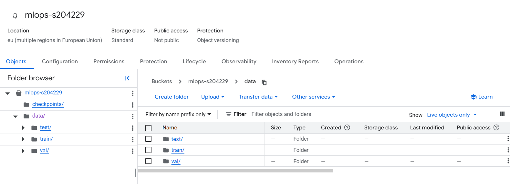
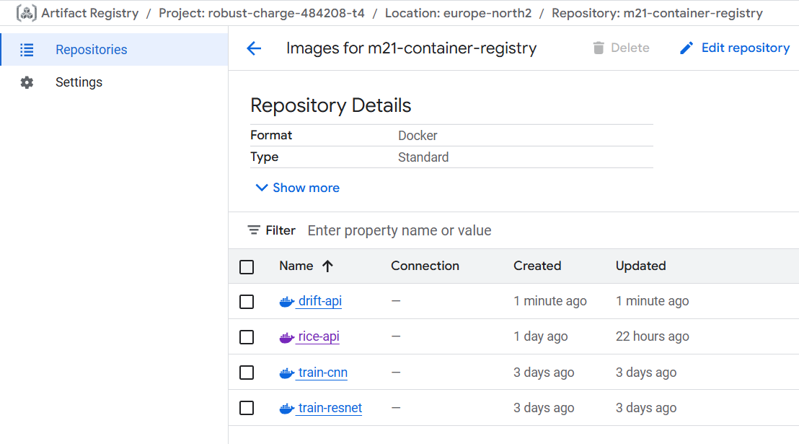
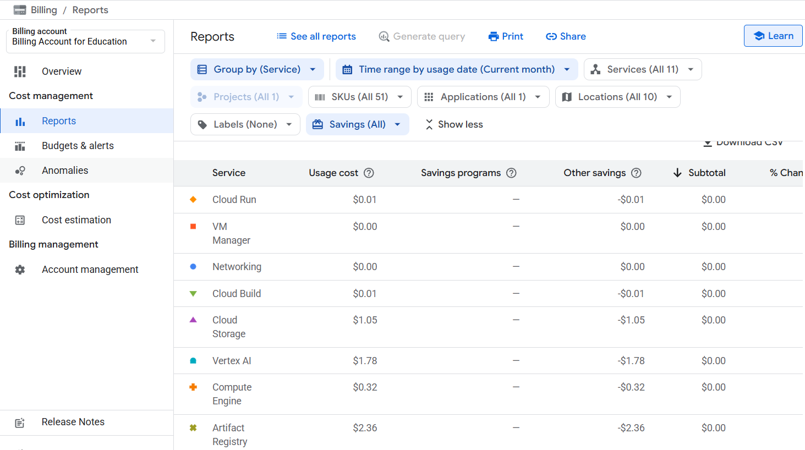

# Exam template for 02476 Machine Learning Operations

This is the report template for the exam. Please only remove the text formatted as with three dashes in front and behind
like:

```--- question 1 fill here ---```

Where you instead should add your answers. Any other changes may have unwanted consequences when your report is
auto-generated at the end of the course. For questions where you are asked to include images, start by adding the image
to the `figures` subfolder (please only use `.png`, `.jpg` or `.jpeg`) and then add the following code in your answer:

``

In addition to this markdown file, we also provide the `report.py` script that provides two utility functions:

Running:

```bash
python report.py html
```

Will generate a `.html` page of your report. After the deadline for answering this template, we will auto-scrape
everything in this `reports` folder and then use this utility to generate a `.html` page that will be your serve
as your final hand-in.

Running

```bash
python report.py check
```

Will check your answers in this template against the constraints listed for each question e.g. is your answer too
short, too long, or have you included an image when asked. For both functions to work you mustn't rename anything.
The script has two dependencies that can be installed with

```bash
pip install typer markdown
```

or

```bash
uv add typer markdown
```

## Overall project checklist

The checklist is *exhaustive* which means that it includes everything that you could do on the project included in the
curriculum in this course. Therefore, we do not expect at all that you have checked all boxes at the end of the project.
The parenthesis at the end indicates what module the bullet point is related to. Please be honest in your answers, we
will check the repositories and the code to verify your answers.

### Week 1

* [x] Create a git repository (M5)
* [x] Make sure that all team members have write access to the GitHub repository (M5)
* [x] Create a dedicated environment for you project to keep track of your packages (M2)
* [x] Create the initial file structure using cookiecutter with an appropriate template (M6)
* [x] Fill out the `data.py` file such that it downloads whatever data you need and preprocesses it (if necessary) (M6)
* [x] Add a model to `model.py` and a training procedure to `train.py` and get that running (M6)
* [x] Remember to fill out the `requirements.txt` and `requirements_dev.txt` file with whatever dependencies that you
    are using (M2+M6)
* [x] Remember to comply with good coding practices (`pep8`) while doing the project (M7)
* [x] Do a bit of code typing and remember to document essential parts of your code (M7)
* [ ] Setup version control for your data or part of your data (M8)
* [x] Add command line interfaces and project commands to your code where it makes sense (M9)
* [x] Construct one or multiple docker files for your code (M10)
* [x] Build the docker files locally and make sure they work as intended (M10)
* [x] Write one or multiple configurations files for your experiments (M11)
* [x] Used Hydra to load the configurations and manage your hyperparameters (M11)
* [x] Use profiling to optimize your code (M12)
* [x] Use logging to log important events in your code (M14)
* [x] Use Weights & Biases to log training progress and other important metrics/artifacts in your code (M14)
* [ ] Consider running a hyperparameter optimization sweep (M14)
* [x] Use PyTorch-lightning (if applicable) to reduce the amount of boilerplate in your code (M15)

### Week 2

* [x] Write unit tests related to the data part of your code (M16)
* [x] Write unit tests related to model construction and or model training (M16)
* [x] Calculate the code coverage (M16)
* [x] Get some continuous integration running on the GitHub repository (M17)
* [x] Add caching and multi-os/python/pytorch testing to your continuous integration (M17)
* [ ] Add a linting step to your continuous integration (M17)
* [x] Add pre-commit hooks to your version control setup (M18)
* [ ] Add a continues workflow that triggers when data changes (M19)
* [ ] Add a continues workflow that triggers when changes to the model registry is made (M19)
* [x] Create a data storage in GCP Bucket for your data and link this with your data version control setup (M21)
* [x] Create a trigger workflow for automatically building your docker images (M21)
* [x] Get your model training in GCP using either the Engine or Vertex AI (M21)
* [x] Create a FastAPI application that can do inference using your model (M22)
* [x] Deploy your model in GCP using either Functions or Run as the backend (M23)
* [x] Write API tests for your application and setup continues integration for these (M24)
* [x] Load test your application (M24)
* [ ] Create a more specialized ML-deployment API using either ONNX or BentoML, or both (M25)
* [ ] Create a frontend for your API (M26)

### Week 3

* [ ] Check how robust your model is towards data drifting (M27)
* [ ] Setup collection of input-output data from your deployed application (M27)
* [ ] Deploy to the cloud a drift detection API (M27)
* [ ] Instrument your API with a couple of system metrics (M28)
* [ ] Setup cloud monitoring of your instrumented application (M28)
* [ ] Create one or more alert systems in GCP to alert you if your app is not behaving correctly (M28)
* [ ] If applicable, optimize the performance of your data loading using distributed data loading (M29)
* [ ] If applicable, optimize the performance of your training pipeline by using distributed training (M30)
* [ ] Play around with quantization, compilation and pruning for you trained models to increase inference speed (M31)

### Extra

* [ ] Write some documentation for your application (M32)
* [ ] Publish the documentation to GitHub Pages (M32)
* [ ] Revisit your initial project description. Did the project turn out as you wanted?
* [ ] Create an architectural diagram over your MLOps pipeline
* [ ] Make sure all group members have an understanding about all parts of the project
* [ ] Uploaded all your code to GitHub


## Project description

In this project we seek to train and evaluate different image classifiers in order to classify different types of rice. 
Our project will use the *Rice Image Dataset* from *Kaggle* (https://www.kaggle.com/datasets/muratkokludataset/rice-image-dataset). This dataset contains 75.000 different 250x250 pixels greyscale images of 5 different grains of rice (15.000 images of each type); namely: Arborio, Basmati, Ipsala, Jasmine & Karacadag. All the images are a photo of a single grain of rice with a corresponding label. We split the dataset into train, validation and test split, with the training set containing 70% of the images, and the validation set and the test set both containing 15% of the images, since this seems to be the standard split size in other DL/ML courses. In all sets we have an equal distribution between the class labels.
We are going to use PyTorch and PyTorch Lightning as the framework for defining and training our models. This will give us a framework where we have good control of the specifics of our code while reducing the amount of boilerplate code needed to be written, giving us more time to focus on our model architecture and hyper-parameter tuning.
We will use the open-source library PyTorch Image Models (TIMM) in our project, by selecting one or more pretrained model(s) from this library, to find which model architecture/type is best suited for classification of rice. We will definitly choose a ResNet model which will be compared to our own model architecture, which probably will be based on a convolutional neural network.

Our goals for this project will be:
    1) Avoid data-leakage.
    2) Minimize overfitting.
    3) Use profiling to optmize our code.
    4) Use logging software such as W&B to moniter the progress of our project.
    5) Get an accuracy above 80%.
    6) Compare different image classification models to find the best suited for our dataset.

## Group information

### Question 1
> **Enter the group number you signed up on <learn.inside.dtu.dk>**
>
> Answer:

Group 26

### Question 2
> **Enter the study number for each member in the group**
> Answer:

*s204206, s204229, s204248*

### Question 3
> **Did you end up using any open-source frameworks/packages not covered in the course during your project? If so**
> **which did you use and how did they help you complete the project?**
>
> Recommended answer length: 0-200 words.
>
> Example:
> *We used the third-party framework ... in our project. We used functionality ... and functionality ... from the*
> *package to do ... and ... in our project*.
>
> Answer:

We used the third-party framework that was the pretrained ResNet18 model from the Timm package in our project, we did this to compare a pretrained model with our own CNN custom model with 4 hidden convolutional layers and 2 fully connected layers. This was to give us an insigth in the advantage of using pretrained models versus to train you own model from scratch.

## Coding environment

> In the following section we are interested in learning more about you local development environment. This includes
> how you managed dependencies, the structure of your code and how you managed code quality.

### Question 4

> **Explain how you managed dependencies in your project? Explain the process a new team member would have to go**
> **through to get an exact copy of your environment.**
>
> Recommended answer length: 100-200 words
>
> Example:
> *We used ... for managing our dependencies. The list of dependencies was auto-generated using ... . To get a*
> *complete copy of our development environment, one would have to run the following commands*
>
> Answer:

We used conda+pip for managin our dependencies. The list of dependencies was auto-generated using pip freeze > requirements.txt, in order to get a precise list of the python packages used and their versions for this project. 
If a new team member were to join our project, they would simply have to create a new conda environement using 'conda create -n <project_name> python=3.12' and then run 'pip install -r requirements.txt'. After this they would have a complete working environment for this project.

### Question 5

> **We expect that you initialized your project using the cookiecutter template. Explain the overall structure of your**
> **code. What did you fill out? Did you deviate from the template in some way?**
>
> Recommended answer length: 100-200 words
>
> Example:
> *From the cookiecutter template we have filled out the ... , ... and ... folder. We have removed the ... folder*
> *because we did not use any ... in our project. We have added an ... folder that contains ... for running our*
> *experiments.*
>
> Answer:

From the cookiecutter template we have filled out the src, tests, data, models and reports folders. We have filled out the scripts in the src folder with the files api.py, data.py, evaluate.py, models.py, train.py. In the data folder we simply made 3 folders that was a train, validation and training folder instead of having the raw and preprocessed folder. In this data folder, the raw data from Rice_Image_Dataset was preproccesed and split into these 3 folders. The overall structure of the project that the src folder is where everything happens, the data proccessing, our model structures, our training script and out api. a lot of these scripts are made to be initialized using the tasks script that works woth invoke. we dont have a specifik docker folder for the docker files but instead have let them "swim" freely in the root of our project which somewhat deviates with the original structure wanting a docker file folder to have it more organized.

### Question 6

> **Did you implement any rules for code quality and format? What about typing and documentation? Additionally,**
> **explain with your own words why these concepts matters in larger projects.**
>
> Recommended answer length: 100-200 words.
>
> Example:
> *We used ... for linting and ... for formatting. We also used ... for typing and ... for documentation. These*
> *concepts are important in larger projects because ... . For example, typing ...*
>
> Answer:

We used Ruff for linting and formatting. We also used Python type hints (typing module) for typing and docstrings for documentation. These concepts are important in larger projects because when multiple people work on the same code consistent formatting and documentation reduce unnecessary confusion and misunderstandings. Documentation also adds to effectivity, since clear documentation can help other team members to understand functions without reviewing every line of code. For example, typing with Python type hints allows team members to see what data types a function are respecting and what they return. Additionally, Ruff enforces consistent code style to ensure that team members are aligned. 


## Version control

> In the following section we are interested in how version control was used in your project during development to
> corporate and increase the quality of your code.

### Question 7

> **How many tests did you implement and what are they testing in your code?**
>
> Recommended answer length: 50-100 words.
>
> Example:
> *In total we have implemented X tests. Primarily we are testing ... and ... as these the most critical parts of our*
> *application but also ... .*
>
> Answer:

In total we have implemented 12 tests. We test the dataloading pipeline by performing four unit tests that validate both structure and content of the loaded data (testing dataset instantiation and data loader creation for train, validation, and test splits). Additionally we perform four test on the CNN model to verify initialization, output of forward pass and execution of training and validation steps. We also implemented four API tests that verify the health endpoint, prediction functionality, handling of invalid file types and load testing.

### Question 8

> **What is the total code coverage (in percentage) of your code? If your code had a code coverage of 100% (or close**
> **to), would you still trust it to be error free? Explain you reasoning.**
>
> Recommended answer length: 100-200 words.
>
> Example:
> *The total code coverage of code is X%, which includes all our source code. We are far from 100% coverage of our **
> *code and even if we were then...*
>
> Answer:

The total code coverage of our code is 57%. 77% in the api.py, 42% in the data.py and 58% in the model.py. If our code had a code coverage of 100% or close to we could still not trust it to be error free. This is because the code coverage is a measure of the amount of lines of code are run during the test. Therefore there can still be meaningful scenarios (input scenarios, unexpected situations or other edge cases) that are not included in the test, and which would result in an error. Therefore in addition to the code coverage other testing would be advisable in order to test the code. 

### Question 9

> **Did you workflow include using branches and pull requests? If yes, explain how. If not, explain how branches and**
> **pull request can help improve version control.**
>
> Recommended answer length: 100-200 words.
>
> Example:
> *We made use of both branches and PRs in our project. In our group, each member had an branch that they worked on in*
> *addition to the main branch. To merge code we ...*
>
> Answer:

We made use of both branches and pull requests in our project. Each group member worked on their own branch alongside the main branch, which helped keep individual changes separated during development. When code was ready to be integrated, we merged it through pull requests created directly in the GitHub web interface rather than using the terminal. This allowed us to review changes and check if tests had passed in the code before merging. In some cases, we mutually agreed to push smaller or less conflicting changes directly to the main branch, as this was more efficient than having others pull from additional branches.

### Question 10

> **Did you use DVC for managing data in your project? If yes, then how did it improve your project to have version**
> **control of your data. If no, explain a case where it would be beneficial to have version control of your data.**
>
> Recommended answer length: 100-200 words.
>
> Example:
> *We did make use of DVC in the following way: ... . In the end it helped us in ... for controlling ... part of our*
> *pipeline*
>
> Answer:

We did make use of DVC in the following way: We managed our dataset by initializing DVC in our repository and configured it to use Google Cloud Storage (gs://mlops-s204229/) as a remote. We tracked the data folder by running `dvc add data` which created the data.dvc file, and pushed it to the GCS remote. This allowed us to version control our data independently from the code stored in Git. In the end it helped us in ensuring reproducibilit, as the exact dataset could be pulled and used for any given model training. It also helped us to be multiple team members working on the same data without coordinating and team members could easily sync to the same data version using DVC.


### Question 11

> **Discuss you continuous integration setup. What kind of continuous integration are you running (unittesting,**
> **linting, etc.)? Do you test multiple operating systems, Python  version etc. Do you make use of caching? Feel free**
> **to insert a link to one of your GitHub actions workflow.**
>
> Recommended answer length: 200-300 words.
>
> Example:
> *We have organized our continuous integration into 3 separate files: one for doing ..., one for running ... testing*
> *and one for running ... . In particular for our ..., we used ... .An example of a triggered workflow can be seen*
> *here: <weblink>*
>
> Answer:

We have set up continuous integration using GitHub Actions with a single workflow file ('tests.yaml') that runs on every push to the main branch and on all pull requests. The workflow focuses on automated testing and code quality checks to ensure reliable development. Unit tests are run using pytest, and we test across multiple operating systems—Ubuntu, Windows, and macOS to verify that there is consistent behavior in different environments. We use Python 3.12 for all tests. To improve efficiency, we enable caching for pip dependencies using the built-in 'cache: 'pip'' action, to avoids repeated downloads and in this way speed up the processes. The workflow performs several key steps: it checks out the repository, sets up the Python environment (with caching), installs dependencies from both 'requirements.txt' and 'requirements_tests.txt', prepares any necessary resources (like a test model checkpoint), and runs all pytest tests with verbose output. By using a matrix strategy, the workflow tests all operating systems in parallel, providing quick feedback if an issue is platform-specific. This continues integration setup ensures that changes are automatically validated before merging, to catch both functional and platform-specific problems early. It helps maintain code quality and consistency for all team members. An example of the workflow can be found here: .[github/workflows/tests.yaml](https://github.com/sorenstange/02476_Machine_learning_operations_Jan26_Group_26/blob/main/.github/workflows/tests.yaml)

## Running code and tracking experiments

> In the following section we are interested in learning more about the experimental setup for running your code and
> especially the reproducibility of your experiments.

### Question 12

> **How did you configure experiments? Did you make use of config files? Explain with coding examples of how you would**
> **run a experiment.**
>
> Recommended answer length: 50-100 words.
>
> Example:
> *We used a simple argparser, that worked in the following way: Python  my_script.py --lr 1e-3 --batch_size 25*
>
> Answer:

We used Hydra for managing experiment configurations through config files. In our setup we use a hierarchical structure with main `config.yaml` file that contains default parameters for data and training, and experiment-specific configs in the `configs/experiment/` folder (cnn.yaml for our CNN model and resnet.yaml for the ResNet model). To run experiments, we execute: `python src/train.py experiment=cnn` to train the CNN model or `python src/train.py experiment=resnet` for the ResNet model. We can override specific parameters on the command line, e.g. `python src/train.py experiment=cnn training_parameters.learning_rate=0.001 training_parameters.epochs=30` to adjust learning rate and/or epochs for a run.

### Question 13

> **Reproducibility of experiments are important. Related to the last question, how did you secure that no information**
> **is lost when running experiments and that your experiments are reproducible?**
>
> Recommended answer length: 100-200 words.
>
> Example:
> *We made use of config files. Whenever an experiment is run the following happens: ... . To reproduce an experiment*
> *one would have to do ...*
>
> Answer:

We made use of multiple reproducibility mechanisms: Firstly we used Hydra to manage configs, so the complete configurations used for each run are saved to the output directory (outputs/YYYY-MM-DD/HH-MM-SS/.hydra/config.yaml). In this way we have a record of hyperparameters, model architecture, and data settings. Secondly, we set a fixed random seed (seed: 42) at the beginning of training using `torch.manual_seed()`, which ensured consistent initialization across all runs. Thirdly, we use Weights & Biases (W&B) to log all experiments with hyperparameters and training metrics. Lastly, we use DVC to version control our dataset, so the exact same 75,000 images can be retrieved for any experiment using `dvc pull`. To reproduce an experiment, one would pull the specific data version with DVC, run the same command (e.g., `python src/train.py experiment=cnn`), and W&B would show the exact same training progression with identical hyperparameters and metrics.

### Question 14

> **Upload 1 to 3 screenshots that show the experiments that you have done in W&B (or another experiment tracking**
> **service of your choice). This may include loss graphs, logged images, hyperparameter sweeps etc. You can take**
> **inspiration from [this figure](figures/wandb.png). Explain what metrics you are tracking and why they are**
> **important.**
>
> Recommended answer length: 200-300 words + 1 to 3 screenshots.
>
> Example:
> *As seen in the first image when have tracked ... and ... which both inform us about ... in our experiments.*
> *As seen in the second image we are also tracking ... and ...*
>
> Answer:

--- question 14 fill here ---

### Question 15

> **Docker is an important tool for creating containerized applications. Explain how you used docker in your**
> **experiments/project? Include how you would run your docker images and include a link to one of your docker files.**
>
> Recommended answer length: 100-200 words.
>
> Example:
> *For our project we developed several images: one for training, inference and deployment. For example to run the*
> *training docker image: `docker run trainer:latest lr=1e-3 batch_size=64`. Link to docker file: <weblink>*
>
> Answer:

For our project we developed several images: one for training our custom CNN model, one for training the ResNet model, one for API deployment, and one for drift detection. This ensures reproducibility and allows team members to run experiments without local environment concerns. To run the training Docker images locally, one would execute: `docker build -f cnn.dockerfile -t rice-trainer-cnn . && docker run --gpus all rice-trainer-cnn experiment=cnn`. For the API: `docker build -f Dockerfile -t rice-api . && docker run -p 8080:8080 rice-api`. Link to CNN dockerfile: [cnn.dockerfile](https://github.com/sorenstange/02476_Machine_learning_operations_Jan26_Group_26/blob/main/cnn.dockerfile).


### Question 16

> **When running into bugs while trying to run your experiments, how did you perform debugging? Additionally, did you**
> **try to profile your code or do you think it is already perfect?**
>
> Recommended answer length: 100-200 words.
>
> Example:
> *Debugging method was dependent on group member. Some just used ... and others used ... . We did a single profiling*
> *run of our main code at some point that showed ...*
>
> Answer:

When we ran into bugs during our experiments, we mainly used error messages, stack traces, and simple print statements to understand what went wrong. When the code ran but was slower than expected, we used profiling to see where most of the time was being spent.

Profiling helped us identify unnecessary overhead in our code. For example, in train.py we discovered that Weights & Biases (wandb) was initialized twice, which caused a large slowdown. We also profiled data.py and found that some code was running even when it was not needed. By redoing the script, we removed this overhead and made the code more efficient by moving preprocessing logic so it only runs when the script is executed directly, and by avoiding unnecessary setup when the data module is imported during training.

## Working in the cloud

> In the following section we would like to know more about your experience when developing in the cloud.

### Question 17

> **List all the GCP services that you made use of in your project and shortly explain what each service does?**
>
> Recommended answer length: 50-200 words.
>
> Example:
> *We used the following two services: Engine and Bucket. Engine is used for... and Bucket is used for...*
>
> Answer:

In this project, we used Cloud Run to deploy the machine learning inference API. Artifact Registry was used to store Docker images for the deployed services. Cloud Storage was used to store the trained model checkpoint files for both the CNN and ResNet models, which were trained in the cloud and later used by the deployed API. 

### Question 18

> **The backbone of GCP is the Compute engine. Explained how you made use of this service and what type of VMs**
> **you used?**
>
> Recommended answer length: 100-200 words.
>
> Example:
> *We used the compute engine to run our ... . We used instances with the following hardware: ... and we started the*
> *using a custom container: ...*
>
> Answer:


We used Google Cloud’s Compute Engine via Vertex AI Custom Jobs to train our deep learning models for rice classification. We ran two separate training jobs: one for our custom CNN and another for a ResNet model. The virtual machines were n1-standard-8 instances with 8 vCPUs, 30 GB memory, and a single NVIDIA Tesla T4 GPU, which allowed us obtain faster training. The jobs were executed using custom Docker containers built from NVIDIA’s PyTorch base image (nvcr.io/nvidia/pytorch:22.07-py3), which included all required dependencies for our training pipeline. These containers were stored in Google Artifact Registry and deployed via YAML configuration files specifying the machine type, GPU, and environment variables, including our Weights & Biases API key. This setup made training efficient and reproducible, as we could run the same container on any instance and ensure consistent results across multiple runs.

### Question 19

> **Insert 1-2 images of your GCP bucket, such that we can see what data you have stored in it.**
> **You can take inspiration from [this figure](figures/bucket.png).**
>
> Answer:





### Question 20

> **Upload 1-2 images of your GCP artifact registry, such that we can see the different docker images that you have**
> **stored. You can take inspiration from [this figure](figures/registry.png).**
>
> Answer:



### Question 21

> **Upload 1-2 images of your GCP cloud build history, so we can see the history of the images that have been build in**
> **your project. You can take inspiration from [this figure](figures/build.png).**
>
> Answer:


### Question 22

> **Did you manage to train your model in the cloud using either the Engine or Vertex AI? If yes, explain how you did**
> **it. If not, describe why.**
>
> Recommended answer length: 100-200 words.
>
> Example:
> *We managed to train our model in the cloud using the Engine. We did this by ... . The reason we choose the Engine*
> *was because ...*
>
> Answer:

Yes, we managed to train two different models in the cloud using the Vertex AI module of the Google Cloud Platform. Docker images where made for each experiment (experiment 1: training our custom CNN model, experiment 2: modifying the pre trained resnet18 model from TIMM) using the cloudbuild_cnn.yaml and cloudbuild_resnet.yaml files and then running 'gcloud builds submit . --config=cloudbuild_cnn.yaml' . These docker images where then excecuted in the Vertex AI module using a custom-job. These can be executed by running 'gcloud builds submit . --config=vertex_ai_train.ayml substitutions=_VERTEX_TRAIN_CONFIG=config_cnn.yaml'. The training job is then submitted, and progress can be followed on the wandb project page.

## Deployment

### Question 23

> **Did you manage to write an API for your model? If yes, explain how you did it and if you did anything special. If**
> **not, explain how you would do it.**
>
> Recommended answer length: 100-200 words.
>
> Example:
> *We did manage to write an API for our model. We used FastAPI to do this. We did this by ... . We also added ...*
> *to the API to make it more ...*
>
> Answer:

Yes, we successfully wrote an API for our model using FastAPI. The trained model is loaded once when the API starts, which improves efficiency and avoids reloading the model for each request. The API includes a simple health route to check if the service is running and a prediction route that accepts an uploaded image file. The uploaded file is first checked to make sure it is an image. The image is then processed in the same way as during training, including resizing, converting to grayscale, and normalizing. This ensures the input format matches what the model expects. The API returns the predicted class along with a confidence score and class probabilities.

### Question 24

> **Did you manage to deploy your API, either in locally or cloud? If not, describe why. If yes, describe how and**
> **preferably how you invoke your deployed service?**
>
> Recommended answer length: 100-200 words.
>
> Example:
> *For deployment we wrapped our model into application using ... . We first tried locally serving the model, which*
> *worked. Afterwards we deployed it in the cloud, using ... . To invoke the service an user would call*
> *`curl -X POST -F "file=@file.json"<weburl>`*
>
> Answer:

Yes, we successfully deployed our machine learning API both locally and in the cloud. The trained models were wrapped in a FastAPI application that exposes a prediction endpoint for image classification. We first verified the API locally by running it with Uvicorn and testing predictions using HTTP requests. For cloud deployment, the application was containerized using Docker and the resulting image was pushed to Google Artifact Registry. The service was then deployed on Google Cloud Run. The deployed service downloads the trained model checkpoint from Google Cloud Storage at startup. The API can be invoked through its public Cloud Run URL. 
FastAPI’s interactive documentation is available at: https://rice-api-879116891440.europe-north2.run.app/docs
Predictions can be made by sending an image file to the /predict endpoint, for example: curl -X POST -F "file=@image.jpg" https://rice-api-879116891440.europe-north2.run.app/predict/

### Question 25

> **Did you perform any unit testing and load testing of your API? If yes, explain how you did it and what results for**
> **the load testing did you get. If not, explain how you would do it.**
>
> Recommended answer length: 100-200 words.
>
> Example:
> *For unit testing we used ... and for load testing we used ... . The results of the load testing showed that ...*
> *before the service crashed.*
>
> Answer:

Yes, we did both unit testing and basic load testing for the API. For unit testing, we used pytest and FastAPI’s TestClient. The tests check that the health route works, that the predict route returns a class and confidence when an image is uploaded, and that non-image files are rejected with an error. Test images are created in memory using PIL, so no external files are needed. When testing all the tests returned that it was working.

We also added a simple load test. This test sends 50 requests to the predict route using 10 concurrent workers. All 50 requests were successful and finished in about 0.75 seconds, which is around 66 requests per second. This shows that the API can handle a large number of simultaneous requests without errors.

### Question 26

> **Did you manage to implement monitoring of your deployed model? If yes, explain how it works. If not, explain how**
> **monitoring would help the longevity of your application.**
>
> Recommended answer length: 100-200 words.
>
> Example:
> *We did not manage to implement monitoring. We would like to have monitoring implemented such that over time we could*
> *measure ... and ... that would inform us about this ... behaviour of our application.*
>
> Answer:

We did not fully manage to deploy monitoring for the deployed model. While a monitoring solution for data drift detection was designed and containerized, the monitoring API could not be successfully deployed to Cloud Run due to errors we did not figure out in time. The planned monitoring approach was to compare reference data from the training distribution with current inference data using summary statistics. By monitoring changes in features such as image brightness, image contrast, model confidence, and predicted class distribution, the system would be able to detect data drift over time. Monitoring would help improve the longevity of the application by identifying when the input data changes compared to the training data. Early detection of data drift would make it possible to retrain or update the model before prediction performance degrades, leading to a more robust and reliable system.

## Overall discussion of project

> In the following section we would like you to think about the general structure of your project.

### Question 27

> **How many credits did you end up using during the project and what service was most expensive? In general what do**
> **you think about working in the cloud?**
>
> Recommended answer length: 100-200 words.
>
> Example:
> *Group member 1 used ..., Group member 2 used ..., in total ... credits was spend during development. The service*
> *costing the most was ... due to ... . Working in the cloud was ...*
>
> Answer:


We could not see how much was used by each member, since we all worked in a single cloud project, but we could see that we ended up using around 6 dollars in credits, where most of them were being used on the artefact registry. It was frustrating to work in the cloud because a lot of time is spent on uploading the Docker image, so if we run into errors in the cloud, we have to do the changes locally, update and make a new docker and upload that image, which for the api took around 1 hour between each update of the files. but the rewarding feeling from having the api up and running through the cloud was big.


### Question 28

> **Did you implement anything extra in your project that is not covered by other questions? Maybe you implemented**
> **a frontend for your API, use extra version control features, a drift detection service, a kubernetes cluster etc.**
> **If yes, explain what you did and why.**
>
> Recommended answer length: 0-200 words.
>
> Example:
> *We implemented a frontend for our API. We did this because we wanted to show the user ... . The frontend was*
> *implemented using ...*
>
> Answer:

No, we did not do any of the extra parts, we had enough of a challenge and succes with getting the model up and deployed in the cloud.

### Question 29

> **Include a figure that describes the overall architecture of your system and what services that you make use of.**
> **You can take inspiration from [this figure](figures/overview.png). Additionally, in your own words, explain the**
> **overall steps in figure.**
>
> Recommended answer length: 200-400 words
>
> Example:
>
> *The starting point of the diagram is our local setup, where we integrated ... and ... and ... into our code.*
> *Whenever we commit code and push to GitHub, it auto triggers ... and ... . From there the diagram shows ...*
>
> Answer:

--- question 29 fill here ---

### Question 30

> **Discuss the overall struggles of the project. Where did you spend most time and what did you do to overcome these**
> **challenges?**
>
> Recommended answer length: 200-400 words.
>
> Example:
> *The biggest challenges in the project was using ... tool to do ... . The reason for this was ...*
>
> Answer:

The biggest obstacle was using GCP. it is much easier to just work locally and fix minor changes, but when working with the cloud, there is a whole new layer to everything that can go wrong. And the uploading takes a lot of time, which was quite demotivating. ChatGPT was used to overcome most of these things, especially the proper commands to run in the terminal, and the Google GEMINI incorporated in the Google Cloud was a big help for getting important information about the occurent errors so we could debug them. Otherwise, most other parts of the project worked fairly well. It was good that we did not have to use too much time to fidel around with hyperparameters since the dataset was so easy for the model to get a high accuracy on it early on. 

### Question 31

> **State the individual contributions of each team member. This is required information from DTU, because we need to**
> **make sure all members contributed actively to the project. Additionally, state if/how you have used generative AI**
> **tools in your project.**
>
> Recommended answer length: 50-300 words.
>
> Example:
> *Student sXXXXXX was in charge of developing of setting up the initial cookie cutter project and developing of the*
> *docker containers for training our applications.*
> *Student sXXXXXX was in charge of training our models in the cloud and deploying them afterwards.*
> *All members contributed to code by...*
> *We have used ChatGPT to help debug our code. Additionally, we used GitHub Copilot to help write some of our code.*
> Answer:

Student s204206 was in charge of setting up the api and deploying it in the cloud.
Student s204229 was in charge of training our models in the cloud and saving the models in the bucket.
Student 204248 made the initial dockerfiles that would later be used for the training and deployment.
All members contributed by following along in the excercises and helping eachother to move on with the different tasks. The cookiecutter template was easy to get working in the repository so we all had a part in that, a lot of the model, data and training scripts was worked out in unisync.
We have used ChatGPT to help debug our code. Additionally, we used GitHub Copilot to help write some of our code. and a bit of google gemini to get help with cloud error messages.
